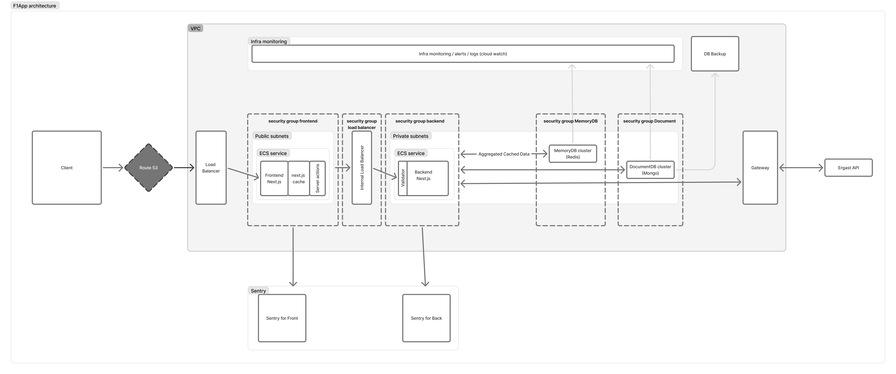

# 🧭 Overview

## Project Purpose
A full-stack web application displaying Formula 1 World Champions from 2005 to the present, demonstrating complete front-end, back-end, DevOps, and testing skills.

## Technology Stack Summary
- **Frontend:** React, Next.js, TypeScript, Custom UI Kit, Storybook, RTL
- **Backend:** NestJS, TypeScript, Redis, MongoDB
- **Infrastructure:** Docker Compose, GitHub Actions, AWS ECS/ECR
- **CI/CD & QA:** Snyk, Biome, GitHub Actions, Multi-stage Dockerfiles

## Architecture Diagram

## Key Trade-offs & Design Decisions
- Chose MongoDB for flexible schema
- Redis for performance on cold starts
- Turborepo for optimizing build and ci processes
- Biome.js for high speed formatting and linting
- Nest.js for flexible and powerfull platform for backend development
- Next.js for hybrid SSR/SPA needs
