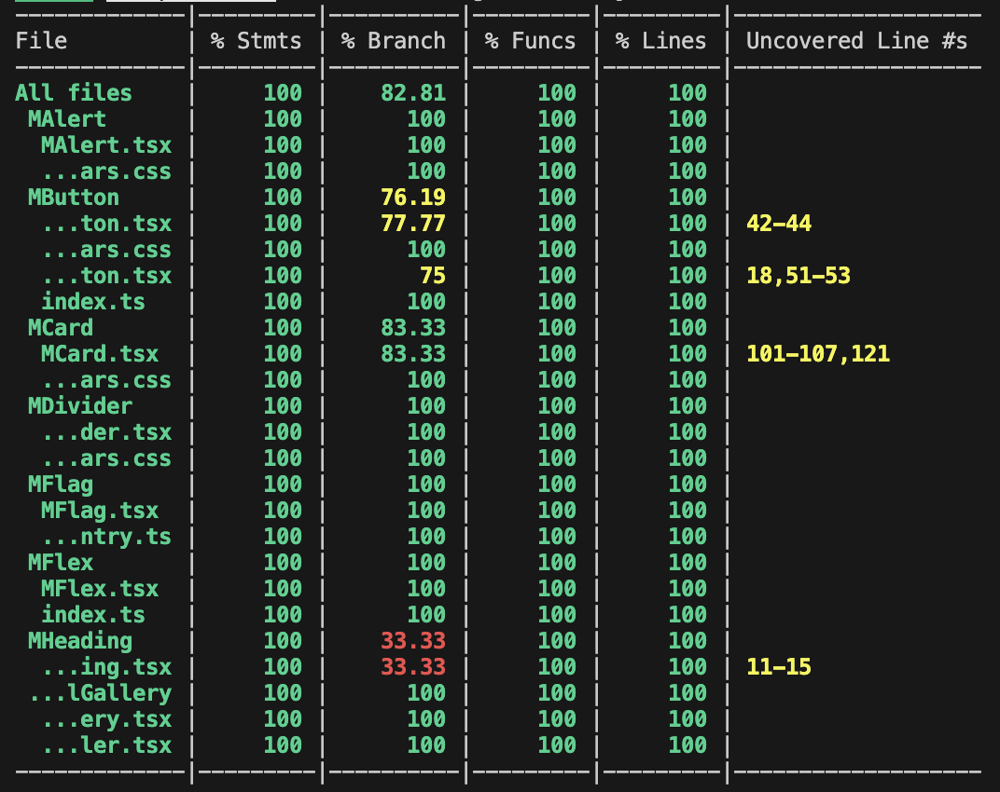
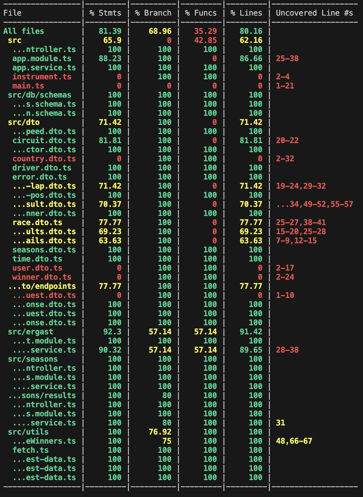

# 🧪 Testing Strategy

## Frontend
- React Testing Library
- Snapshot and behavior testing
- Coverage: 90%+

## Backend
- Jest
- Unit and integration tests
- Coverage: 80%+

## CI Integration
- Tests executed on pre-commit 
- Pipeline with tests and lint runs on every pull request creation
